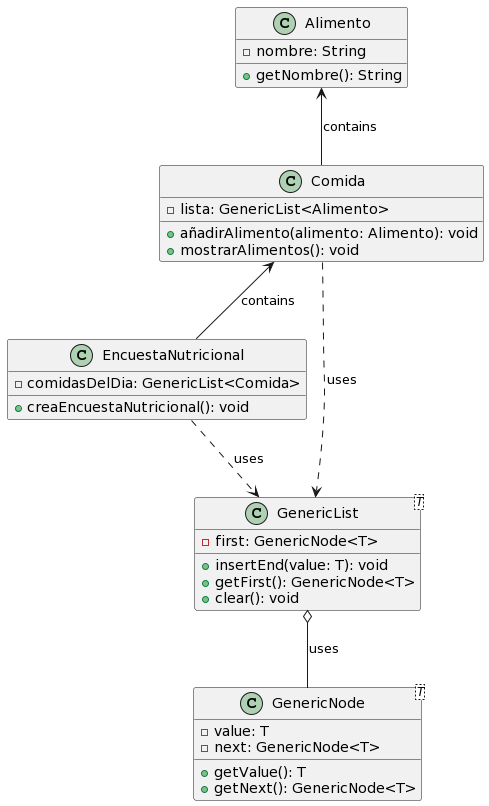

# Encuesta Nutricional

## Descripción
--Para una mejor jerarquización sería conveniente hacer uso de más clases, pero con la base propuesta para este examen, esta es mi propuesta de mejora.

Este programa es una aplicación de consola diseñada para realizar encuestas nutricionales. Permite a los usuarios introducir y revisar sus hábitos alimenticios diarios, registrando diferentes tipos de comidas y los alimentos específicos consumidos en cada una. La aplicación facilita la recolección de datos dietéticos de manera estructurada, apoyando una evaluación nutricional efectiva.

## Cómo Ejecutar el Programa

Para ejecutar este programa:

1. Asegúrate de tener Java instalado en tu sistema.
2. En Visual Studio Code navega al directorio donde se encuentra el archivo `Main.java`.
3. Ejecuta el programa desde la opción "Run java".

Sigue las instrucciones en pantalla para completar la encuesta nutricional.

## Diagrama de Clases UML

A continuación se muestra el diagrama de clases UML del programa, ilustrando la estructura y las relaciones entre las clases `Alimento`, `Comida`, `EncuestaNutricional`, `GenericList` y `GenericNode`.

## Clases del Proyecto

A continuación, se proporcionan enlaces simulados a las clases del proyecto. Deberás reemplazar estos placeholders con los enlaces reales a tu repositorio de código:

- [Alimento.java](Alimento.java)
- [Comida.java](Comida.java)
- [EncuestaNutricional.java](EncuestaNutricional.java)
- [GenericList.java](utils/generica/GenericList.java)
- [GenericNode.java](utils/generica/GenericNode.java)
