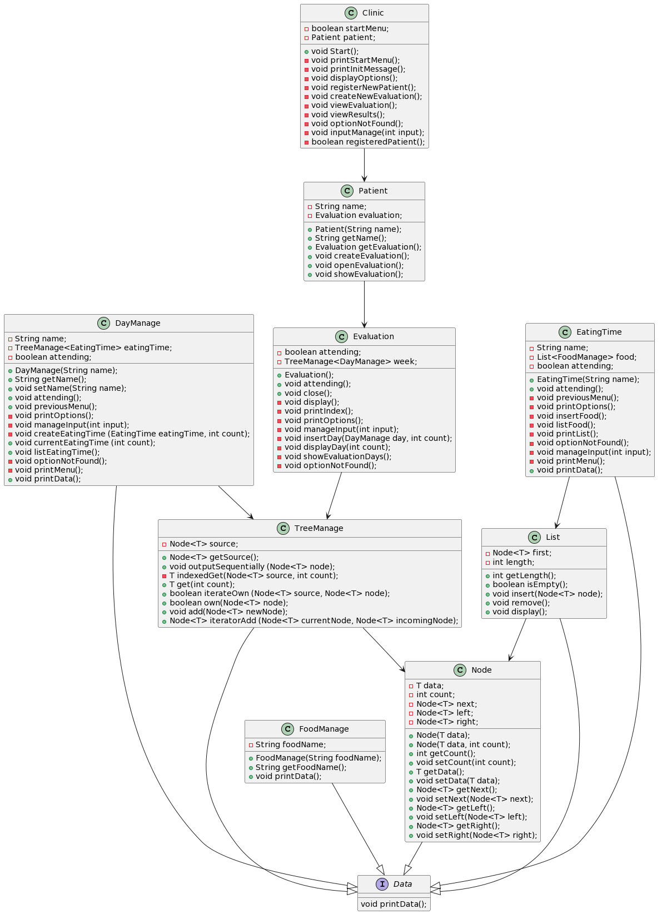

# Encuestas para dietas
El siguiente proyecto tiene commo finalidad el poder presentar una forma de registrar pacientes
en una clinica, donde se les hará una encuesta sobre su ingesta de comida. Esto, con la finalidad
de proporcionarles una dieta balanceada con respecto a los alimentos que consumen. 

## Visión
### El proyecto esta diseñado para que:
* Se registre un paciente
* Se registren los alimentos que se han consumido (Esto dependiendo del día y el tiempo de comida)
* Y finalmente se puedan ver los resultados

## Diagrama

|      Diagrama de Clases      |
|:----------------------------:|
|  |


## Interfaz que se muestra en cada paso

### Interfaz inicial

```
+------------------------------------------------------------------------------------------------------------------------------+
| Seleccione una opcion: ( 1 [Registrar Paciente] / 2 [Crear evaluacion] / 3 [Ver resultados de la evaluacion] / 0 [Salir]) |
+------------------------------------------------------------------------------------------------------------------------------+
 1
```

### Interfaz de Registro de paciente
```
+----------------------+
| Nombre del paciente: 
+----------------------+
Santiago
```

### Interfaz con paciente registrado
```
+------------------------------------+
| Paciente: Santiago |
+------------------------------------------------------------------------------------------------------------------------------+
| Seleccione una opcion: ( 1 [Registrar Paciente] / 2 [Crear evaluacion] / 3 [Ver resultados de la evaluacion] / 0 [Salir]) |
+------------------------------------------------------------------------------------------------------------------------------+
```

### Interfaz de creación de una evaluación
```
+------------------------------------------------------------------------------------------------------------------------------+
| Deberá de ir seleccionando el día en el cual quiere agregar una comida.                                                      |
| En cada día hay diferentes tiempos de comida en los cuales deberá seleccionar uno para agregar la comida que ingirió ese día |
+------------------------------------------------------------------------------------------------------------------------------+

+-------------------------------------------------------------------------------+
| Seleccione un día (entre Dia [1] - Dia [5]) para agregar la comida en ese día |
| Seleccione [0] para regresar / [6] para mostrar los días completos            |
+-------------------------------------------------------------------------------+
1
```

### Interfaz de selección de tiempo de comida
```
Dia 1
+-----------------------------------------------------------------------------------------------------------------------------------------------------------------------+
| Seleccione un tiempo de comida (1 [Desayuno] / 2 [Media Mañana] / 3 [Almuerzo] / 4 [Merienda] / 5 [Cena] / 9 [Listar tiempos de Comida] / 0 para ir al menu anterior) |
+---------------------------------------------------------------------------------------------*-------------------------------------------------------------------------+
 1
```

### Interfaz de opciones de acción en tiempo de comida
```
Desayuno
+-------------------------------------------------------------------------------------------------------------+
| Seleccione una accion ([1] para agregar comida / [2] para mostrar la comida / [0] para ir al menu anterior) |
+-------------------------------------------------------------------------------------------------------------+
1
```

### Interfaz de registro de comida ingerida (opción [0] para finalizar)
```
+------------------+
| Comida ingerida: 
Huevos revueltos
+------------------+
| Comida ingerida: 
Pan tostado
+------------------+
| Comida ingerida: 
Zumo de naranja
+------------------+
| Comida ingerida: 
0
```

### Intefaz para mostrar la comida que se ha agregado
* input
```
Desayuno
+-------------------------------------------------------------------------------------------------------------+
| Seleccione una accion ([1] para agregar comida / [2] para mostrar la comida / [0] para ir al menu anterior) |
+-------------------------------------------------------------------------------------------------------------+
 2
```
* Output
```
                Huevos revueltos
                Pan tostado
                Zumo de naranja
+-----------------------------------------+
```

### Interfaz para mostrar la comida en todos los días
* input
```
+------------------------------------------------------------------------------------------------------------------------------+
| Deberá de ir seleccionando el día en el cual quiere agregar una comida.                                                      |
| En cada día hay diferentes tiempos de comida en los cuales deberá seleccionar uno para agregar la comida que ingirió ese día |
+------------------------------------------------------------------------------------------------------------------------------+
 
+-------------------------------------------------------------------------------+
| Seleccione un día (entre Dia [1] - Dia [5]) para agregar la comida en ese día |
| Seleccione [0] para regresar / [6] para mostrar los días completos            |
+-------------------------------------------------------------------------------+
 
6
```
* Output (acción [0] para salir)
```
+------------------------+
|        Paciente        |
+------------------------+
+------------------------+
        Dia 1
+------------------------+
            Desayuno
                Huevos revueltos
                Pan tostado
                Zumo de naranja
+-----------------------------------------+
+------------------------+
        Dia 2
+------------------------+
            Media Mañana
                Cereal
                Pan tostado
                Agua
+-----------------------------------------+
+------------------------+
        Dia 3
+------------------------+
            Almuerzo
                Pollo al horno
                Arroz blanco
                Coca - Cola
+-----------------------------------------+
0
```

###  Interfaz para ver resultados de la evluación actual
* input
```
+------------------------------------+
| Paciente: Santiago |
+------------------------------------------------------------------------------------------------------------------------------+
| Seleccione una opcion: ( 1 [Registrar Paciente] / 2 [Crear evaluacion] / 3 [Ver resultados de la evaluacion] / 0 [Salir]) |
+------------------------------------------------------------------------------------------------------------------------------+
 
3
```

* output (acción [0] para salir)
```
Nombre del paciente: Santiago
+------------------------+
|        Paciente        |
+------------------------+
+------------------------+
        Dia 1
+------------------------+
            Desayuno
                Huevos revueltos
                Pan tostado
                Zumo de naranja
+-----------------------------------------+
+------------------------+
        Dia 2
+------------------------+
            Media Mañana
                Cereal
                Pan tostado
                Agua
+-----------------------------------------+
+------------------------+
        Dia 3
+------------------------+
            Almuerzo
                Pollo al horno
                Arroz blanco
                Coca - Cola
+-----------------------------------------+
0
```


