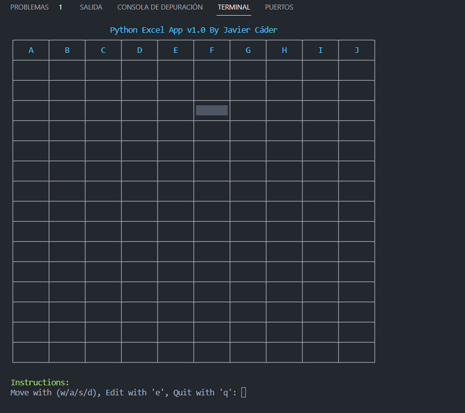

## 1. Setting Up:
- Make sure you have Python installed on your computer. If not, download it from Python's official website.
- Save the given code into a file, say excel_app.py.

## 2. Running the App:
- Open your terminal or command prompt.
Navigate to the directory where you saved excel_app.py.
`python excel_app.py` and hit Enter.

### - Navigating the App:
Once the app is running, you'll see an Excel sheet right in your terminal!
Use the w/a/s/d keys to move around the cells:
w - Move up
s - Move down
a - Move left
d - Move right
The cell you're currently on will have a different background, so you can easily spot it.

### - Editing Cells:
Want to jot something down? No worries!
With the cell highlighted, press e.
Type in your content. Note: The cell can only take content up to a certain width, so if you type a lengthy novel, it might get cut off. Stick to the essentials!

### - Exiting the App:
Done for the day? Simply press q to quit.

### - Oops, Made a Mistake?:
If you accidentally press a key that's not in the list of commands, the app will gently remind you it's an invalid action. Just follow the prompts, and you'll be back on track.
