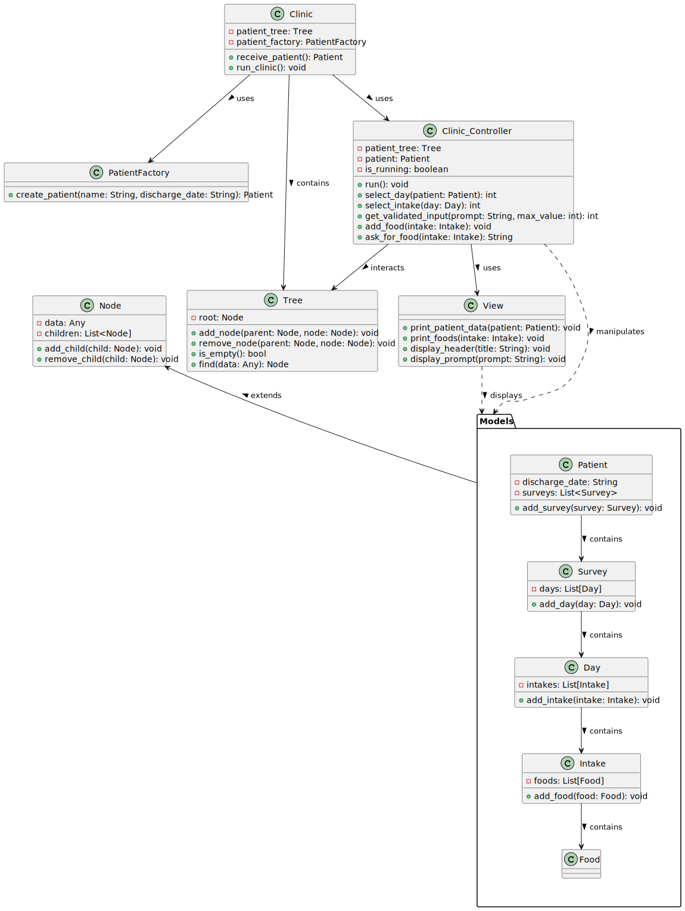

# Clinic Management System

## Project Overview

This Clinic Management System is designed to streamline the operations of a medical clinic. It utilizes a Model-View-Controller (MVC) architecture to manage patient data and interactions efficiently. The system is built in a way that ensures modularity, ease of maintenance, and scalability.

### Class Relationships and Structure

- **Clinic**: This is the main class that manages the overall functioning of the clinic. It utilizes a `Tree` data structure to organize patient data and employs a `PatientFactory` for creating new patient records.

- **PatientFactory**: A factory class responsible for creating new `Patient` objects. This helps in abstracting the creation logic and facilitates easy modifications for patient instantiation.

- **Tree and Node**: These classes are used to implement a tree data structure. The `Tree` class manages the nodes, which can represent patients, surveys, days, intakes, and foods. The `Node` class is a base class extended by various models.

- **Clinic_Controller**: This class acts as the controller in the MVC pattern. It is responsible for handling user input, manipulating the model data, and interacting with the `View` for data presentation.

- **View**: This class is responsible for all data presentation. It displays patient data, intake details, and other relevant information.

- **Models Package**: This package includes various model classes such as `Patient`, `Survey`, `Day`, `Intake`, and `Food`. These classes extend the `Node` class and represent different aspects of patient data and clinic operations.

#### Models Relationships:

- `Patient` contains `Survey`.
- `Survey` contains `Day`.
- `Day` contains `Intake`.
- `Intake` contains `Food`.

### Diagram

To visualize the relationships and structure of the system, refer to the class diagram presented below:

| PUML | Class Diagram |
|:-------------:|:---------:|
| [PUML Code](./docs/puml/Examen_Final.puml) |   |

### Conclusion

The Clinic Management System is designed to offer a structured and efficient way of managing patient data and clinic operations, leveraging the principles of MVC architecture and tree data structures for optimal organization and scalability.
