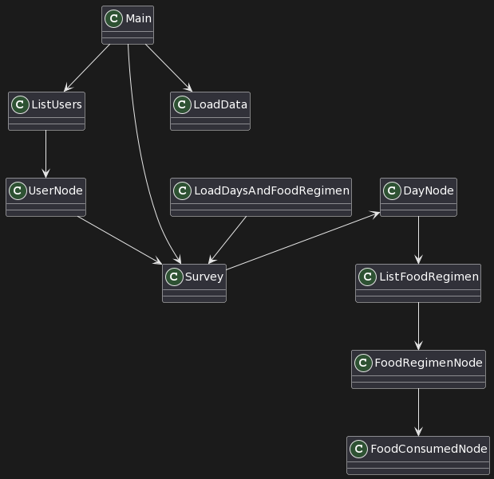

# Examen Final de Estructura de Datos y Algoritmos I

Examen final de la asignatura de EDA I 23-24
By. Juan René Ixcopal San José

## Encuestas y dietas


La valoración nutricional a partir de encuestas de 24 horas se refiere a un método utilizado en nutrición para evaluar la ingesta dietética de una persona durante un período específico de 24 horas.

Esta técnica es una herramienta común en estudios epidemiológicos y en la práctica clínica para obtener una instantánea de los hábitos alimentarios de un individuo.


## Reto

Desarrollar un sistema para gestionar encuestas de 24 horas que recopilen datos sobre la ingesta alimentaria de individuos. Utilizaremos las estructuras de datos vistas en la asignatura para organizar y almacenar los datos de las encuestas.

| Paciente      | Encuesta      | Dias         | Ingestas     | Alimentos                   |
|---------------|---------------|--------------|--------------|-----------------------------|
| Nombre        | Fecha de toma | Hasta 5 días | Desayuno     | Los que indique el paciente |
| Fecha de alta |               |              | Media Mañana |                             |
|               |               |              | Almuerzo     |                             |
|               |               |              | Merienda     |                             |
|               |               |              | Cena         |                             |


# Glosario de entidades

| Entidad                | Definición                                                                                                                                                                          |
|------------------------|-------------------------------------------------------------------------------------------------------------------------------------------------------------------------------------|
| Main                   | Entidad encargada de iniciar todo el sistema de encuestas con los menús.                                                                                                            |
| UserNode               | Entidad encargada de guardar la información de cada usurio (Nombre, fecha de alta).                                                                                                 |
| ListUsers              | Entidad encargada de gestionar todos los usuarios, listar todos los usuario y crear usuarios.                                                                                       |
| DayNode                | Entidad encargad de guardar los datos del día, (nombre del día ej: Lunes, Martes).                                                                                                  |
| Survey                 | Entidad encargada de gestionar la encuesta y posee propiamente los días, debido a que una encuesta debe de poseer los días de la misma.                                             |
| FoodConsumedNode       | Entidad encargada de guardar los datos de a comida consumida por el usuario.                                                                                                        |
| FoodRegimenNode        | Entidad encargada de guardar los datos del régimen alimenticio, como es Desayuno, Almuerzo, Cena, etc, etc.                                                                         |
| ListFoodRegimen        | Entidad encatgada de gestionar el régimen alimenticio.                                                                                                                              |
| LoadDaysAndFoodRegimen | Entidad encargada de cargar los días deseados así como asignarle a cada día un régimen alimenticio, para tener la opción de crear un régimen alimenticio para un día en específico. |


## Diagrama de clases
|         Diagrama de clases          |
|:-----------------------------------:|
|  |


## Propuesta de interfaz

```
---------------------------------------------------------
Seleccione una opción:
1. Consultar Encuestas
2. Crear Usuario
3. Listar Todos los Usuarios
4. Salir
---------------------------------------------------------
: 1
---------------------------------------------------------
Seleccione una opción:
1. Consultar encuesta de un usuario
2. Volver al Menú Principal
---------------------------------------------------------
: 1
Ingrese el nombre del usuario para consultar la encuesta:
Rene
---------------------------------------------------------
Seleccione una opción:
1. Mostrar encuesta del usuario
2. Agregar comida a la encuesta
3. Volver al menú anterior
---------------------------------------------------------
: 1
Encuesta de Rene:
Lunes:
	Desayuno
		Huevos fritos
		Zumo de naranja
	Media Mañana
	Almuerzo
	Merienda
	Cena
Martes:
	Desayuno
	Media Mañana
	Almuerzo
	Merienda
	Cena
Miercoles:
	Desayuno
	Media Mañana
	Almuerzo
	Merienda
	Cena
Jueves:
	Desayuno
	Media Mañana
	Almuerzo
	Merienda
	Cena
Viernes:
	Desayuno
	Media Mañana
	Almuerzo
	Merienda
	Cena
```