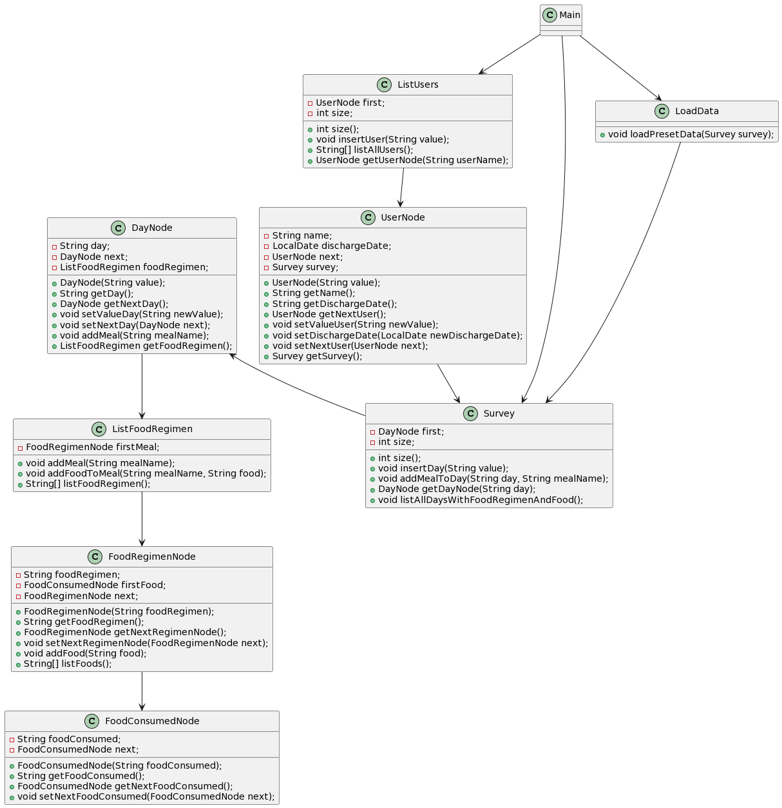

# Encuestas y dietas


## Modelo de dominio
|       Modelo de Dominio        |
|:------------------------------:|
|  |


## Reto

Desarrollar un sistema para gestionar encuestas de 24 horas que recopilen datos sobre la ingesta alimentaria de individuos. Utilizaremos las estructuras de datos vistas en la asignatura para organizar y almacenar los datos de las encuestas.

|Paciente| Encuesta      | Dias         | Ingestas | Alimentos                   |
|-|---------------|--------------|-|-----------------------------
Nombre| Fecha de toma | Hasta 5 días | Desayuno | Los que indique el paciente 
Fecha alta| -             | -            | Media Mañana |-
|-| -             | -            | Almuerzo                    |-
|-| -             | -            | Merienda |-
|-| -             | -            | Cena                        |-

## Propuesta de interfaz

```
---------------------------------------------------------
Seleccione una opción:
1. Consultar Encuestas
2. Crear Usuario
3. Listar Todos los Usuarios
4. Salir
---------------------------------------------------------
: 1
---------------------------------------------------------
Seleccione una opción:
1. Consultar encuesta de un usuario
2. Volver al Menú Principal
---------------------------------------------------------
: 1
Ingrese el nombre del usuario para consultar la encuesta:
Rene
---------------------------------------------------------
Seleccione una opción:
1. Mostrar encuesta del usuario
2. Agregar comida a la encuesta
3. Volver al menú anterior
---------------------------------------------------------
: 1
Encuesta de Rene:
Lunes:
	Desayuno
		Huevos fritos
		Zumo de naranja
	Media Mañana
	Almuerzo
	Merienda
	Cena
Martes:
	Desayuno
	Media Mañana
	Almuerzo
	Merienda
	Cena
Miercoles:
	Desayuno
	Media Mañana
	Almuerzo
	Merienda
	Cena
Jueves:
	Desayuno
	Media Mañana
	Almuerzo
	Merienda
	Cena
Viernes:
	Desayuno
	Media Mañana
	Almuerzo
	Merienda
	Cena
```