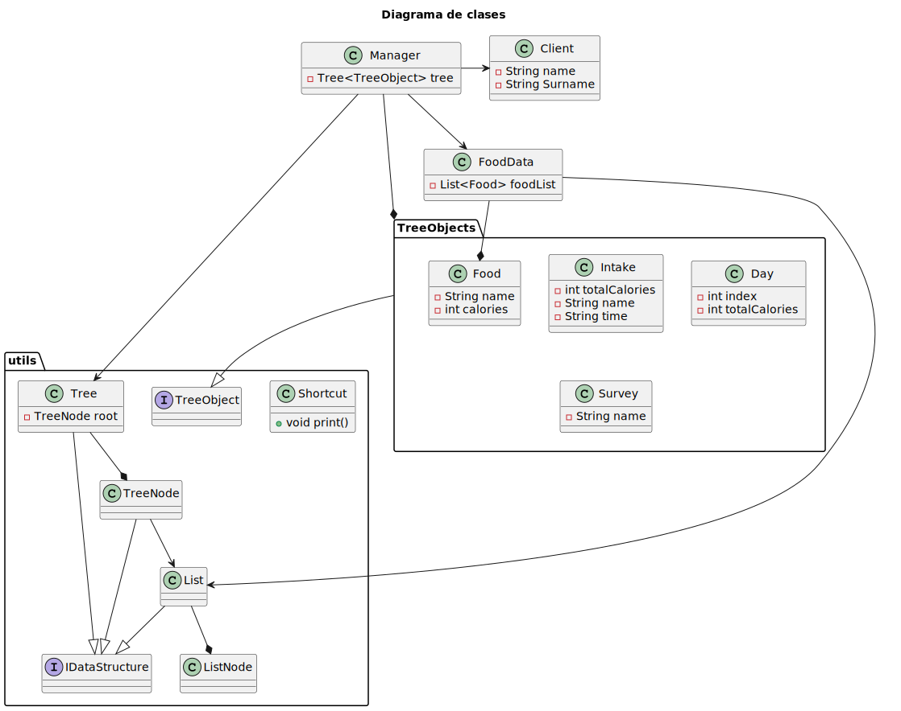

# Documentacion Examen Base
El proyecto realizado es una aplicación de gestión de dieta que permite a los usuarios realizar un seguimiento de su ingesta diaria de alimentos. La aplicación utiliza una estructura de árbol para organizar la información sobre la dieta, los alimentos y las comidas diarias. 
## Funcionalidades Principales
- Visualización de la Dieta: La aplicación permite a los usuarios ver su dieta en forma de un árbol, mostrando los días, las comidas y los alimentos consumidos.
- Añadir Comida: Los usuarios pueden añadir nuevas comidas a su dieta. La aplicación garantiza que no se exceda el límite de comidas por día.
- Añadir Alimento: Los usuarios pueden seleccionar alimentos predefinidos de una lista y añadirlos a su dieta.
- Añadir Alimento Manualmente: Los usuarios también tienen la opción de añadir alimentos manualmente, proporcionando el nombre y las calorías.
- Borrar Alimento: La aplicación permite a los usuarios eliminar alimentos específicos de su dieta.
- Actualización Automática de Calorías: Las calorías totales se actualizan automáticamente al añadir o borrar alimentos, proporcionando un resumen diario de calorías consumidas.

## Estructura Principal
### Modelo de dominio:

### Diagrama de clases:
