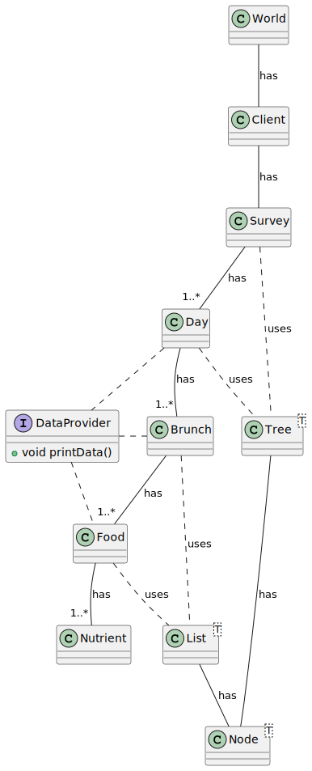

# Proyecto Dietas Examen Final Jorge Quiñonez

Desarrollar un sistema para gestionar encuestas de 24 horas que recopilen datos sobre la ingesta alimentaria de individuos. Utilizaremos las estructuras de datos vistas en la asignatura para organizar y almacenar los datos de las encuestas.

## Propuesta de solución

### Iniciar simulación
Para iniciar la aplicación se debe ir al archivo [World](./World.java), desde ahí se inicia toda la simulación.

### Descripción del programa
Se utilizan Árboles y Listas para almacenar y gestionar Nodos que a su vez, almacenan a las clases principales de la solución.

Ya que las clases [Árbol](./Tree.java), [Lista](./List.java), y [Nodo](./Node.java) están adaptadas de manera genérica, cualquier clase que desee ser almacenada en estos, deberá implementar la interfaz [DataProvider](./DataProvider.java) la cual es indispensable para el correcto funcionamiento de las clases mencionadas.

## Diagrama de clases

