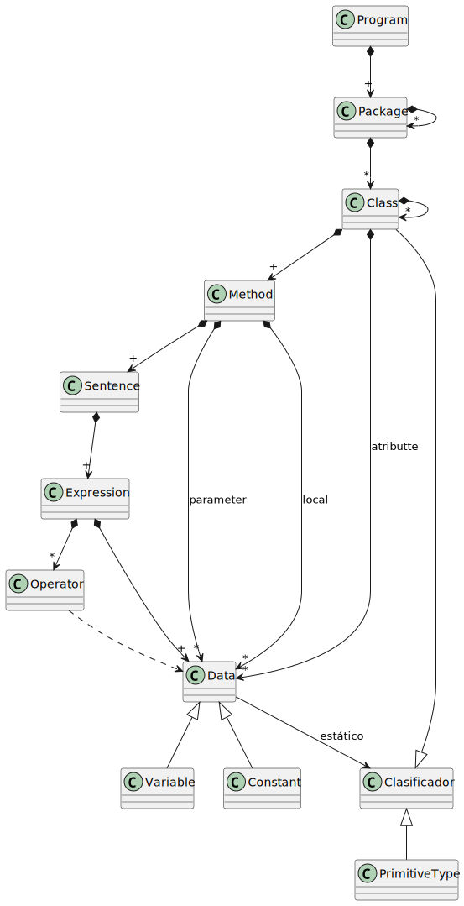

# Intro

## Por qué

Hemos trabajado con matrices y clases para solucionar problemas básicos y estos conceptos, aunque potentes, no son suficientes para manejar desafíos más complejos en desarrollo de software.

La necesidad de manejar estructuras de datos más complejas surge naturalmente:

- Al intentar implementar algoritmos y funcionalidades.
- Al manejar grandes volúmenes de datos.
- Al tratar de optimizar el rendimiento del software.

<table>
    <tr>
        <td>
<ul>
    <li>Un programa se compone de paquetes que se componen de otros paquetes y clases, bajo el paradigma de la programación modular
    <ul>
        <li>Cada clase reúne atributos presentes en todas sus instancias, que pueden ser de tipo primitivo o de alguna clase junto con sus métodos
        <li>Cada método reúne parámetros y un conjunto de sentencias:
        <ul>
            <li>crear dato, sentencias de declaración de variables/constantes
            <li>modificar datos, sentencias de asignación, entrada y salida
            <li>eliminar datos, asociados a los ámbitos de los métodos
            <li>consultar datos, mediante referencias desde las expresiones
        </ul>
        <li>Las sentencias contienen expresiones que pueden ser
        <ul>
            <li>expresiones simples mediante la mención de los datos o literales
            <li>expresiones compuestas mediante la combinación de operadores
        </ul>
        <li>Las sentencias pueden ser compuestas, bajo el paradigma de la programación estructurada
        <ul>
            <li>sentencia secuencial, para la creación de ámbitos anidados en el ámbito del progrma,
            <li>sentencia alternativa, para alternar la ejecución de sentencias,
            <li>sentencia iterativa, para repetir la ejecución de sentencias.
            <li>sentencias con excepciones, para elevar, capturalas y delegarlas.
        </ul>
        <li>Los datos, constantes o variables, pueden ser de tipo
        <ul>
            <li>primitivo, para átomos de información sin propiedades e inmutables
            <li>matrices, para colecciones compuestas de datos homogéneas
            <li>objetos, para colecciones compuestas de datos heterogéneas bajo el paradigma de la programación orientada a objetos
        </ul>
    </ul>
</ul>
        </td>
        <td width="50%" valign="top">
            
            <i><small>Fuente: Prof. Luis Fernández</small></i>
        </td>
    <tr>
</table>

## Qué

| |
|-|
Repaso de clases, objetos y matrices
Estructuras de datos.
Conceptos de complejidad relacionados con las estructuras de datos.

## Para qué

| |
|-|
Lograr escribir software más eficiente, manejar grandes volúmenes de datos, e implementar algoritmos y funcionalidades más complejas. 
Además, entender **cómo** y **por qué** ciertas estructuras de datos son más adecuadas para ciertos problemas, lo cual permite **tomar decisiones informadas** al escribir código en el futuro.

## Cómo

| |
|-|
Para ilustrar estos conceptos, se utilizarán como referencia proyectos que ya hayamos trabajado.
Veremos cómo las decisiones afectaron/afectan/afectarán el rendimiento y la funcionalidad, y cómo la introducción de los nuevos conceptos *podrían permitir* mejoras significativas.
Se desarrollarán ejercicios prácticos y ejemplos de código para reforzar el aprendizaje y permitir experimentar de primera mano los efectos de diferentes estructuras de datos y operaciones.

|2View:|
|-|
[Primitivas, matrices, clases & objetos](primitivasMatricesClasesObjetos.md)
[Estructuras de datos](estructurasDeDatos.md)
[Operaciones básicas sobre estructuras de datos](operacionesBasicas.md)
[Complejidad temporal y espacial de las operaciones](complejidadTemporal.md)
Relación entre estructuras de datos y eficiencia del software
